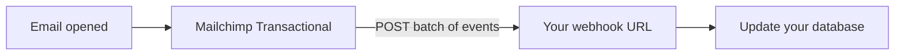

Polling for message status doesn't scale. Webhooks let Mailchimp Transactional push events to your application the moment they happen, so your systems always reflect reality.

## How webhooks work

When you register a webhook URL, we POST batches of events to it as they occur. A single batch can contain up to 1,000 events, delivered as form-encoded data in a `mailchimp_events` field.



## Registering a webhook

Use [`/webhooks/add`](/api-reference/webhooks/add) with the URL to receive events and the event types you care about:

```json
{
  "key": "YOUR_API_KEY",
  "url": "https://example.com/webhooks/mailchimp",
  "events": ["send", "open", "click", "hard_bounce", "soft_bounce"]
}
```

## Event types

| Event | Fires when |
| --- | --- |
| `send` | A message is handed off for delivery. |
| `open` | A recipient opens a tracked message. |
| `click` | A recipient clicks a tracked link. |
| `hard_bounce` | Delivery permanently fails. |
| `soft_bounce` | Delivery temporarily fails. |
| `spam` | A recipient marks the message as spam. |

## Verifying authenticity

We send a `HEAD` request to confirm your endpoint before activating a webhook, then sign each batch. Validate the signature against your webhook key before trusting incoming data.

<Warning>
  Always respond to webhook requests with a `2xx` status quickly. Slow responses can cause retries and duplicate processing.
</Warning>
