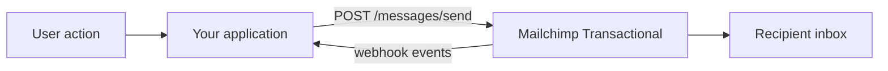

<Note>
  Mailchimp Transactional was formerly known as **Mandrill**. You may see references to both names while the migration completes.
</Note>

## Send email your users actually need

Mailchimp Transactional is a delivery API for the one-to-one, triggered emails your application sends every day: password resets, order confirmations, shipping notifications, and receipts. Unlike marketing email, recipients don't subscribe to a list. Your application sends a message the moment an event happens, and we deliver it in seconds.

<CardGroup cols={2}>
  <Card title="Quickstart" icon="rocket" href="/quickstart">
    Send your first message in under five minutes.
  </Card>
  <Card title="Authentication" icon="key" href="/authentication">
    Generate an API key and authenticate your requests.
  </Card>
  <Card title="Send email" icon="paper-plane" href="/guides/sending-email">
    Compose and send messages with full HTML, tracking, and tagging.
  </Card>
  <Card title="API Reference" icon="code" href="/api-reference/messages/send">
    Explore every endpoint with an interactive playground.
  </Card>
</CardGroup>

## Why developers choose Transactional

<CardGroup cols={3}>
  <Card title="Fast delivery" icon="bolt">
    Time-sensitive messages reach the inbox in seconds, not minutes.
  </Card>
  <Card title="Deliverability" icon="shield-check">
    Dedicated infrastructure and reputation management keep you out of spam.
  </Card>
  <Card title="Full visibility" icon="chart-line">
    Track opens, clicks, and bounces per message, or push events to your own systems with webhooks.
  </Card>
</CardGroup>

## How it works

Your application's database is the source of truth for your users. Transactional doesn't store contact lists. When an event happens, you pass the recipient and content in a single API request, and we handle delivery, tracking, and reporting.

Ready to send? Start with the [Quickstart](/quickstart).
